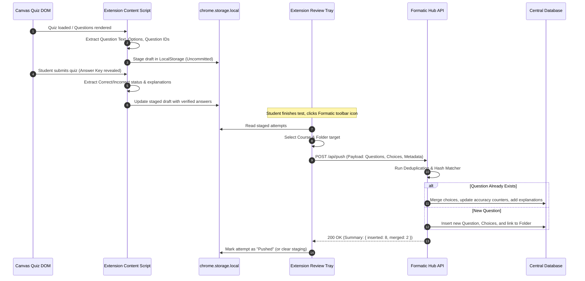

# System Architecture: Formatic

**Formatic** is an automated formative test capture, deduplication, and collaborative study platform for Canvas LMS quizzes. It consists of two primary components:
1. **Formatic Stealth Saver (Chrome Extension MV3)**: A passive, non-intrusive client-side listener that captures quiz questions, choices, student responses, and post-submission answer keys without triggering Canvas LMS anti-cheat/proctoring flags.
2. **Formatic Hub (Web Repository & Study Suite)**: A collaborative web application featuring Git-like push ingestion, hierarchical course folder management, question deduplication/merging, "soft-login" authentication with role-based access, and an Aternos-inspired blocky white-and-blue study interface (StudyStack tables, practice tests, and interactive flashcards).

---

## 1. High-Level System Architecture

```mermaid
flowchart TD
    subgraph ClientBrowser["Student Browser (Canvas LMS Tab)"]
        CanvasDOM["Canvas Quiz DOM<br/>(#questions, .quiz_question)"]
        ExtContentScript["Formatic Content Script<br/>(Passive MutationObserver / DOM Parser)"]
        ExtStorage["Extension Local Cache<br/>(chrome.storage.local)"]
        ExtPopup["Extension Review Tray<br/>(Inspect & Prepare Push)"]
    end

    subgraph FormaticWeb["Formatic Hub (Web Application)"]
        WebFrontend["Next.js / React Frontend<br/>(Aternos Blocky UI, Study Modes)"]
        API["REST / tRPC API Layer"]
        DeduplicationEngine["Deduplication & Conflict Resolver"]
        AuthSystem["Soft-Login & RBAC Module"]
        FolderEngine["Hierarchical Folder Manager"]
    end

    subgraph DataPersistence["Database Layer"]
        DB[(PostgreSQL / SQLite via Prisma)]
    end

    CanvasDOM -.->|Passive Reads Only (No Events Dispatched)| ExtContentScript
    ExtContentScript -->|Write Staged Attempts| ExtStorage
    ExtStorage -->|Review Staged Questions| ExtPopup
    ExtPopup -->|HTTP POST /api/sync/push| API
    WebFrontend -->|Browse / Study / Admin Actions| API
    API --> DeduplicationEngine
    API --> AuthSystem
    API --> FolderEngine
    DeduplicationEngine --> DB
    AuthSystem --> DB
    FolderEngine --> DB
```

---

## 2. Canvas LMS Anti-Detection & Proctoring Deep-Dive

### 2.1 How Canvas Quiz Auditing Works
Canvas LMS includes a built-in feature known as **Canvas Quiz Log Auditing** (`/courses/:id/quizzes/:id/history`). During a quiz attempt, Canvas tracks events using native DOM listeners attached to `window` and `document`:
1. **Window Blur & Focus (`window.onblur`, `window.onfocus`)**: Canvas logs `"Stopped viewing the canvas quiz..."` when the quiz window loses operating system or browser tab focus.
2. **Page Visibility API (`document.visibilitychange`, `document.hidden`)**: Triggers an event when the user switches tabs or minimizes the browser window.
3. **Mouse Leave (`document.mouseleave`)**: Logs when the cursor leaves the active viewport area on specific proctored setups.
4. **Keystroke / Cut / Copy / Paste Interception**: Monitors clipboard events (`copy`, `cut`, `paste`) on quiz form fields.

### 2.2 Proof of Stealth: Why Formatic Extension Will NOT Red-Flag
Browser extensions executing as **Content Scripts** run in an **Isolated World** specification defined by W3C:
- **No Focus Interruption**: An extension content script runs directly in the JavaScript runtime of the current tab. Inspecting the DOM does not emit `blur`, `focusout`, or `visibilitychange`.
- **Zero Tab Switching**: Because question capturing occurs in-page automatically in the background, the user never switches tabs or minimizes the window.
- **Passive Read-Only DOM Access**: Formatic uses a read-only `MutationObserver` on the `#questions` container. It **never** dispatches synthetic `MouseEvent`, `KeyboardEvent`, or `FocusEvent`.
- **Zero Network Tampering**: Formatic does not block, delay, or modify Canvas's native AJAX calls (`/submissions/` or `/quizzes/take`). It strictly observes already-rendered DOM nodes.

### 2.3 Strict Engineering Constraints for Codex
To guarantee 100% safety during formative tests:
> [!CAUTION]
> 1. **NEVER call `.focus()`, `.blur()`, or `.click()`** on any native Canvas DOM element.
> 2. **NEVER inject modal popups or alert dialogs (`window.alert`, `window.confirm`)** into the Canvas tab while a quiz is ongoing.
> 3. **DO NOT attach visible overlay widgets that steal pointer focus**. The extension in-page status indicator must have CSS `pointer-events: none; user-select: none;` or reside entirely inside the browser toolbar popup.
> 4. **Isolate all mutation handlers** using `requestIdleCallback` or asynchronous queues to prevent frame-rate drops that Canvas telemetry might log as high main-thread latency.

---

## 3. Data Flow & Git-Like Push Model



---

## 4. Deduplication & Conflict Resolution Algorithm

Canvas formative quizzes often draw from question pools, resulting in repeat encounters across multiple attempts and students.

### 4.1 Question Normalization & Hashing
To determine identity regardless of minor formatting differences:
1. **HTML Strip**: Strip all HTML tags, whitespace, `&nbsp;`, line breaks, and punctuation.
2. **Text Normalization**: Convert to lowercase, normalize mathematical symbols (e.g., Unicode minus to standard hyphen).
3. **Hash Generation**: Generate SHA-256 hash of the normalized question body:
   $$\text{QuestionHash} = \text{SHA-256}(\text{normalize}(\text{question\_text}))$$

### 4.2 Matching Strategy
1. **Exact Hash Match**: If `QuestionHash` matches an existing entry in the target course or global question pool:
   - Mark as **Matched**.
2. **Fuzzy String Match (Levenshtein / Dice Coefficient)**: If no exact hash matches, compute Dice Coefficient against questions in the same course. If similarity $> 0.92$, flag as probable duplicate for admin review or auto-merge.

### 4.3 Merge Logic
When a pushed question matches an existing question in the database:
- **Choices**: Add any previously unseen choices.
- **Answer Verification**:
  - If existing question has `is_verified = false` and incoming question contains verified feedback (`is_correct = true`), update the choice with `is_correct = true` and mark question `is_verified = true`.
  - If both report conflicting correct answers, keep the latest, flag `has_conflict = true`, and log for Admin review.
- **Encounter Metrics**:
  - Increment `times_encountered = times_encountered + 1`.
  - Increment `times_answered_correctly` or `times_answered_incorrectly` according to student telemetry.
- **Explanation**: If incoming attempt has a detailed explanation/rationale from Canvas and the existing record lacks one, populate `explanation`.

---

## 5. Database Schema (Prisma Specification)

```prisma
datasource db {
  provider  = "postgresql" // PostgreSQL for Vercel serverless deployment
  url       = env("DATABASE_URL") // Pooled connection for application queries
  directUrl = env("POSTGRES_URL") // Direct connection for migrations
}

generator client {
  provider = "prisma-client-js"
}

enum Role {
  USER
  ADMIN
}

enum QuestionType {
  MULTIPLE_CHOICE
  MULTIPLE_ANSWERS
  TRUE_FALSE
  SHORT_ANSWER
  ESSAY
}

model User {
  id           String     @id @default(uuid())
  username     String     @unique
  passwordHash String     // Simple argon2 or bcrypt hash
  nickname     String?
  role         Role       @default(USER)
  createdAt    DateTime   @default(now())
  updatedAt    DateTime   @updatedAt

  submissions  PushBatch[]
  folders      Folder[]   @relation("UserFolders")
  activityLogs AdminLog[]
}

model Folder {
  id          String     @id @default(uuid())
  name        String
  description String?
  color       String?    @default("#2F80ED")
  icon        String?    @default("folder")

  // Hierarchical nesting
  parentId    String?
  parent      Folder?    @relation("FolderHierarchy", fields: [parentId], references: [id], onDelete: Cascade)
  children    Folder[]   @relation("FolderHierarchy")

  creatorId   String
  creator     User       @relation("UserFolders", fields: [creatorId], references: [id])

  questions   Question[]
  createdAt   DateTime   @default(now())
  updatedAt   DateTime   @updatedAt

  @@index([parentId])
}

model Question {
  id              String       @id @default(uuid())
  hash            String       @unique // Normalized SHA-256
  text            String       // Raw rendered question text (markdown/HTML preserved)
  plainText       String       // Stripped text for search
  questionType    QuestionType @default(MULTIPLE_CHOICE)
  explanation     String?      // Canvas feedback explanation if provided
  isVerified      Boolean      @default(false)
  hasConflict     Boolean      @default(false)

  // Statistics
  timesEncountered Int         @default(1)
  timesCorrect     Int         @default(0)
  timesIncorrect   Int         @default(0)

  folderId        String
  folder          Folder       @relation(fields: [folderId], references: [id], onDelete: Cascade)

  choices         Choice[]
  pushItems       PushBatchItem[]

  createdAt       DateTime     @default(now())
  updatedAt       DateTime     @updatedAt

  @@index([folderId])
  @@index([hash])
}

model Choice {
  id          String   @id @default(uuid())
  questionId  String
  question    Question @relation(fields: [questionId], references: [id], onDelete: Cascade)
  text        String
  isCorrect   Boolean? // null if unconfirmed, true/false if known
  feedback    String?

  createdAt   DateTime @default(now())
  updatedAt   DateTime @updatedAt

  @@index([questionId])
}

model PushBatch {
  id           String          @id @default(uuid())
  userId       String
  user         User            @relation(fields: [userId], references: [id])
  canvasCourse String?
  quizTitle    String?
  totalItems   Int
  newItems     Int
  mergedItems  Int

  items        PushBatchItem[]
  createdAt    DateTime        @default(now())
}

model PushBatchItem {
  id          String    @id @default(uuid())
  batchId     String
  batch       PushBatch @relation(fields: [batchId], references: [id], onDelete: Cascade)
  questionId  String
  question    Question  @relation(fields: [questionId], references: [id])
  wasNew      Boolean
}

model AdminLog {
  id          String   @id @default(uuid())
  adminId     String
  admin       User     @relation(fields: [adminId], references: [id])
  action      String   // E.g., "MERGE_QUESTIONS", "DELETE_QUESTION", "UPDATE_ANSWER"
  targetId    String
  details     String?  // JSON formatted details
  createdAt   DateTime @default(now())
}
```

---

## 6. Authentication Architecture: "Soft Login"

For low-friction peer collaboration among classmates, Formatic eliminates email verification links, OAuth sign-in popups, and phone verifications:
1. **Instant Onboarding**: User enters a desired `username` and a simple `passcode` (e.g., 4-digit PIN or short password).
2. **Session Issuance**: Server verifies credentials (or auto-creates user if username is available in "open registration mode") and issues an HTTP-only JWT cookie or bearer token.
3. **Role Differentiation**:
   - `USER`: Can create/rename their own folders, view all shared folders, push captured quiz data, use all study tools (StudyStack, Practice Test, Flashcards).
   - `ADMIN`: Assigned via seed script or designated admin secret key. Can edit/delete any question, resolve answer conflicts, rename/reorganize global folders, and view push history logs.

---

## 7. UI/UX Architecture: Aternos / Minecraft Aesthetic

The design language mimics the distinct **Aternos** web console aesthetic: clean, blocky, highly structured, with crisp white backgrounds, bold Minecraft-blue accents, and tactile beveled controls.

### 7.1 Design Tokens
- **Background**: `#FFFFFF` (Surface), `#F3F6FA` (Canvas / App background), `#E5EBF5` (Card background alternate).
- **Primary Blue**: `#2F80ED` (Main action buttons, active borders).
- **Dark Accent Blue**: `#1B5EBE` (Bevel edges, button click states, navigation bar headers).
- **Secondary Ice Blue**: `#EBF3FE` (Chip backgrounds, selection states).
- **Neutral Dark**: `#1E293B` (Typography headers), `#475569` (Body text).
- **Border Treatment**: 2px solid `#2F80ED` or 2px solid `#D1D5DB`.
- **Corner Radius**: `0px` to `4px` maximum (Strictly rectangular/blocky).
- **Blocky Tactile Elevation**:
  ```css
  /* Aternos-style 3D blocky button */
  .btn-blocky {
    background-color: #2f80ed;
    color: #ffffff;
    border: 2px solid #1b5ebe;
    border-radius: 4px;
    box-shadow: 0 4px 0 #1b5ebe;
    font-weight: 700;
    transition: all 0.05s ease-in-out;
  }
  .btn-blocky:active {
    transform: translateY(4px);
    box-shadow: 0 0 0 #1b5ebe;
  }
  ```

### 7.2 Study Suite Views
1. **StudyStack Side-by-Side Table**:
   - Two-column dense blocky grid: `[ Question & Details ]` | `[ Correct Answer & Rationale ]`.
   - Feature: "Hide Answers" toggle button for rapid self-recitation.
   - Filter bar: Filter by verified questions only, search keywords, or filter by quiz attempt date.
2. **Practice Test Engine**:
   - Simulates formative quiz attempts using stored questions.
   - Randomized options, option selection state with blocky checkmarks.
   - Instant feedback mode vs. Exam mode (score calculated upon final submit).
3. **Flashcard Reviewer**:
   - 3D blocky flip card (Question on Front, Answer + Explanation on Back).
   - Flip triggered by Spacebar or Click.
   - "Got It" (`[1]` key) vs. "Need Review" (`[2]` key) buckets with progress indicator.
